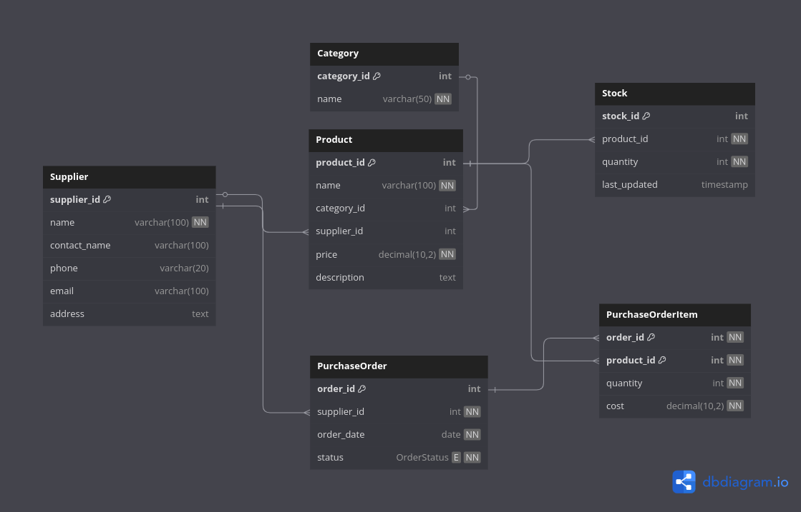

# 📦 Watu Inventories – Inventory Management System (MySQL)

A robust **Inventory Management System** built using **MySQL**, aimed at tracking products, suppliers, stock levels, and inventory movements. This system is ideal for small to medium businesses that need an organized database for managing their stock efficiently.
The system also includes role based access policy.
---

## 🚀 Features

- ✅ Product registration with category and supplier links
- ✅ Supplier management with contact details
- ✅ Stock tracking: quantity in/out, restocking
- ✅ Sales & purchase records
- ✅ Data integrity with foreign key constraints
- ✅ Sample data for easy testing

---

## 🛠️ Technologies Used

- **Database**: MySQL
- **Modeling Tool**: DBML for visual ERD
    
- **File Types**: `.sql`, `.dbml`

---

## 📘 Schema Overview

### Main Tables

- `Category`: Product categories (e.g., Electronics, Furniture)
- `Supplier`: Vendor information
- `Product`: Stock-keeping unit (SKU) details
- `InventoryTransaction`: Records stock in/out movements
- `Purchase`: Purchases from suppliers
- `Sale`: Sales to customers

---

## 🔄 Relationships

- One category → many products
- One supplier → many products & purchases
- One product → many inventory transactions
- InventoryTransaction → tracks both incoming and outgoing stock
